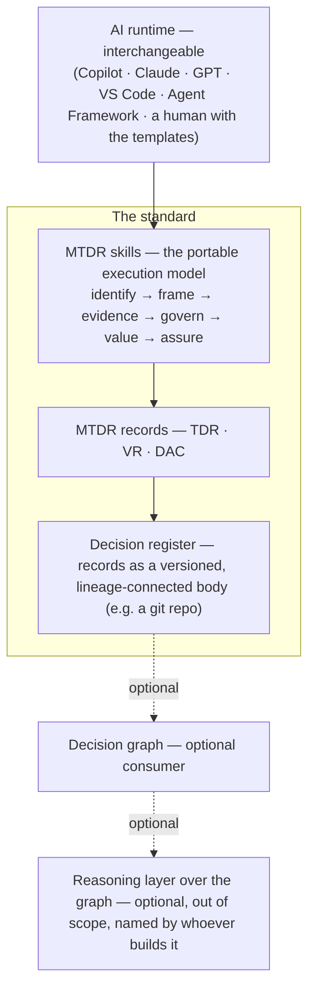

# MTDR architecture — where the standard ends

The TDR standard is deliberately layered, and the layers are separable. This page draws the
whole shape in one picture so an architect can see, at a glance, what the standard *is*,
what merely *implements* it, and what optionally *consumes* it.

The load-bearing claim is a boundary, not a stack:

> **The standard ends at the decision register.** Everything above the register is the
> standard; everything below it is an optional consumer of the standard's output. A
> conforming implementation can stop at the register and be complete.

## The layers

| Layer | What it is | In the standard? |
|---|---|---|
| **AI runtime** | The environment that applies the skills — any agent runtime that loads the open skill format, or a human with the templates. Interchangeable by design (see [`/agents`](agents/)). | No — the standard is runtime-neutral |
| **Skills** | The [thirteen skills](skills/) as a portable execution model: each transforms the artefact — a raw transcript becomes an identified decision, becomes a framed record, becomes an evidenced and governed one, becomes (where material) an assured one. Passes, not prompts. | **Yes** |
| **Records** | The three record types — [TDR](spec.md), [VR](spec-value-record.md), [DAC](spec-decision-assurance.md) — as complete, valid markdown files. | **Yes** |
| **Decision register** | The records held as a versioned body with lineage — a git repository, a documents system, a wiki. This is where a conforming implementation ends. | **Yes — the boundary** |
| **Decision graph** | An optional consumer that assembles the register's records (via the `supersedes` / `derived_from` / `confirmed_by_outcome` lineage fields, spec §6) into a queryable graph — to answer "what did this decision govern?", "what would superseding it invalidate?", "what is the accumulated risk position?". | No — an implementation choice that *enhances* the standard |
| **Reasoning layer** | An optional higher-order capability operating over the graph. Out of scope for the standard; named and owned by whoever builds it. | No — built on top |

## Why the boundary sits at the register

Three properties of the standard already draw this line; this page only makes it visible.

- **Progressive adoption** (DAC spec §4). The standard states its own adoption ladder: records
  alone → records plus assurance on material decisions → organisational risk context → a graph
  computing the resultant position → continuous assurance. Each rung is useful without the next,
  and **nothing in the standard requires a graph**. The register is the rung every adopter reaches;
  the graph is a rung some choose.
- **Graph-ready without graph tooling** (spec §6). Three flat frontmatter fields —
  `supersedes`, `derived_from`, `confirmed_by_outcome` — make a register assemble into a
  connected history whenever someone wants it to. Any tool can do the assembling later; no tool
  is required to. The lineage lives in the records, not in a database.
- **The record is never the runtime object.** A decision *record* captures judgement; whatever
  executes, monitors or reasons over decisions is a separate, downstream thing. The standard is
  careful never to conflate them — which is precisely what lets the graph and everything above it
  be optional and vendor-independent.

## Two consequences for adopters

1. **You can start today with nothing but the register.** A folder of valid records, held under
   version control, with lineage fields filled in, is a complete, conforming MTDR implementation.
   Value accrues immediately — organisational memory, accountability evidence — with no graph and
   no platform.
2. **The layers above are yours to choose or replace.** The graph technology, the reasoning layer,
   the runtime that authored the records — each is an independent, swappable choice. The standard
   ties you to none of them. That is the point of an open standard: the specification is fixed;
   the implementations compete.

---

*This page is descriptive, not normative — it draws boundaries the specifications already define.
The normative text is in [`spec.md`](spec.md), [`spec-value-record.md`](spec-value-record.md) and
[`spec-decision-assurance.md`](spec-decision-assurance.md). The decision to publish this overview
is recorded in [TDR-0012](decisions/TDR-0012-architecture-overview.md).*
