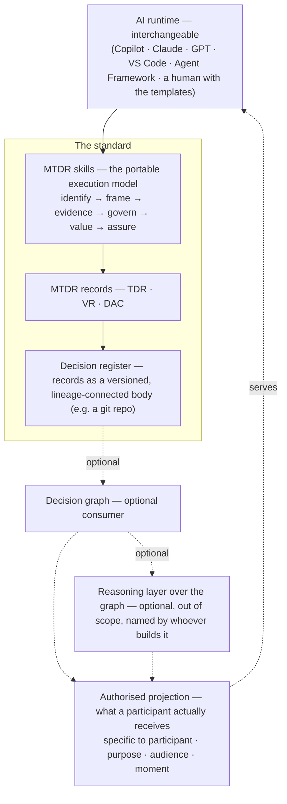

# MTDR architecture — where the standard ends

The TDR standard is deliberately layered, and the layers are separable. This page draws the
whole shape in one picture so an architect can see, at a glance, what the standard *is*,
what merely *implements* it, and what optionally *consumes* it.

The load-bearing claim is a boundary, not a stack:

> **The standard ends at the decision register.** Everything above the register is the
> standard; everything below it is an optional consumer of the standard's output. A
> conforming implementation can stop at the register and be complete.

```mermaid
flowchart TD
    R["AI runtime — interchangeable<br/>(Copilot · Claude · GPT · VS Code · Agent Framework · a human with the templates)"]
    S["MTDR skills — the portable execution model<br/>identify → frame → evidence → govern → value → assure"]
    Rec["MTDR records — TDR · VR · DAC"]
    Reg["Decision register — records as a versioned, lineage-connected body (e.g. a git repo)"]
    G["Decision graph — optional consumer"]
    TI["Reasoning layer over the graph — optional, out of scope, named by whoever builds it"]
    P["Authorised projection — what a participant actually receives<br/>specific to participant · purpose · audience · moment"]

    R --> S --> Rec --> Reg
    Reg -.->|optional| G -.->|optional| TI
    G -.-> P
    TI -.-> P
    P -.->|serves| R

    subgraph STD ["The standard"]
        S
        Rec
        Reg
    end
```

## The layers

| Layer | What it is | In the standard? | What it enforces |
|---|---|---|---|
| **AI runtime** | The environment that applies the skills — any agent runtime that loads the open skill format, or a human with the templates. Interchangeable by design (see [`skills/packaging/`](skills/packaging/)). | No — the standard is runtime-neutral | Nothing; it receives a projection and acts within it |
| **Skills** | The [thirty-two skills](skills/) — twenty-four normative, and eight governance-reconstruction skills proposed under [TDR-0034](decisions/TDR-0034-governance-reconstruction-and-forum-evolution.md) — as a portable execution model: each transforms the artefact — a raw transcript becomes an identified decision, becomes a framed record, becomes an evidenced and governed one, becomes (where material) an assured one. The six interpretation skills enter the same model one step earlier, from arbitrary organisational material ([TDR-0018](decisions/TDR-0018-interpretation-skills-and-the-artefact-boundary.md)). Passes, not prompts. | **Yes** | Nothing — method, not control |
| **Records** | The three record types — [TDR](records/decision/specification/tdr.md), [VR](records/value/specification/vr.md), [DAC](records/decision/specification/dac.md) — as complete, valid markdown files. | **Yes** | **Nothing.** A record carries judgement, not controls (spec §10) |
| **Decision register** | The records held as a versioned body with lineage — a git repository, a documents system, a wiki. This is where a conforming implementation ends. | **Yes — the boundary** | Storage, existence visibility, retrieval, direct access and compartments — *within its administrative domain* |
| **Decision graph** | An optional consumer that assembles the register's records (via the `supersedes` / `derived_from` / `confirmed_by_outcome` lineage fields, spec §6) into a queryable graph — to answer "what did this decision govern?", "what would superseding it invalidate?", "what is the accumulated risk position?". | No — an implementation choice that *enhances* the standard | Nothing by itself; it is a consumer, and is itself served through projections |
| **Reasoning layer** | An optional higher-order capability operating over the graph. Out of scope for the standard; named and owned by whoever builds it. | No — built on top | Evaluates identity, mandate, entitlement, applicability and effectiveness; governs *system-mediated* use, disclosure and release; *manages* inference risk |
| **Authorised projection** | Not a layer so much as what every consumer actually hands onward: a view specific to participant, purpose, audience and moment. No participant receives "the register". | No — out of scope, but the reason the boundary matters | The point at which access and disclosure decisions are applied |

**No layer guarantees concealment, and none governs what a person does with information once they have legitimately read it** (spec §10). The diagram shows where responsibility sits, not where risk ends.

### The same layers, read semantically

The table above answers *who enforces what*. The same stack answers a second question — *where does meaning
live* — and reading it that way is what keeps a future specification honest:

| | Layer | Reads as |
|---|---|---|
| **Meaning** | Records | What the acts *mean* — what it is to have decided, superseded, rejected |
| **Memory** | Decision register | What was said, preserved exactly as it was said |
| **Reasoning** | Graph and anything above it | What is computed from the preserved records — applicability, position, conflict |
| **Behaviour** | Runtime, and the organisation around it | What is actually done, under a projection |

**Authority does not appear as a row, and that is deliberate.** It is not a stage in the pipeline and it does
not emerge from storage: a store can preserve records perfectly while enforcing nothing about who was
entitled to write them. Authority is an **orthogonal governance plane** that cuts across every layer —

> **Meaning** — what the language says · **Authority** — who is entitled to say it · **Memory** — preserve
> exactly what was said · **Reasoning** — compute the current position · **Behaviour** — act.

The allocation table in [TDR-0015](decisions/TDR-0015-visibility-and-effectiveness.md) shows why it cannot be
a single row: it already splits authority between the store (existence visibility, retrieval, compartments)
and the downstream consumer (identity, mandate, entitlement). Anything that folds "who may" into "what is
held" loses that split, and with it the reason the boundary is where it is.

**Access is not authority, either.** Controlling what a participant may see or which system actions they may
invoke is a different question from whose speech counts as having decided, and under what mandate. A system
that can answer the first and believes it has answered the second will treat a permission grant as an
organisational mandate — which is how accountability quietly detaches from the people who hold it.

Meaning is not enforcement, and neither is memory: that a record *means* a decision was taken is exactly why
it can neither confer authority nor establish that the decision is in force (§10, §11).

The practical consequence is the reason this reading is written down. Should the standard ever specify a
language rather than a format, that specification defines **what a conforming interpreter must compute — it
does not compute**, in the same way a language standard defines required behaviour without being an
implementation. The semantics layer may grow; the boundary does not move. See
[TDR-0017](decisions/TDR-0017-language-admission-test.md).

## Why the boundary sits at the register

Three properties of the standard already draw this line; this page only makes it visible.

- **Progressive adoption** (DAC spec §4). The standard states its own adoption ladder: records
  alone → records plus assurance on material decisions → organisational risk context → a graph
  computing the resultant position → continuous assurance. Each rung is useful without the next,
  and **nothing in the standard requires a graph**. The register is the rung every adopter reaches;
  the graph is a rung some choose.
- **Graph-ready without graph tooling** (spec §6). Three flat frontmatter fields —
  `supersedes`, `derived_from`, `confirmed_by_outcome` — make a register assemble into a
  connected history whenever someone wants it to. Any tool can do the assembling later; no tool
  is required to. The lineage lives in the records, not in a database.
- **The record is never the runtime object.** A decision *record* captures judgement; whatever
  executes, monitors or reasons over decisions is a separate, downstream thing. The standard is
  careful never to conflate them — which is precisely what lets the graph and everything above it
  be optional and vendor-independent.

## Two consequences for adopters

1. **You can start today with nothing but the register.** A folder of valid records, held under
   version control, with lineage fields filled in, is a complete, conforming MTDR implementation.
   Value accrues immediately — organisational memory, accountability evidence — with no graph and
   no platform.
2. **The layers above are yours to choose or replace.** The graph technology, the reasoning layer,
   the runtime that authored the records — each is an independent, swappable choice. The standard
   ties you to none of them. That is the point of an open standard: the specification is fixed;
   the implementations compete.

---

*This page is descriptive, not normative — it draws boundaries the specifications already define.
The normative text is in [`spec.md`](records/decision/specification/tdr.md), [`spec-value-record.md`](records/value/specification/vr.md) and
[`spec-decision-assurance.md`](records/decision/specification/dac.md). The decision to publish this overview
is recorded in [TDR-0012](decisions/TDR-0012-architecture-overview.md).*
